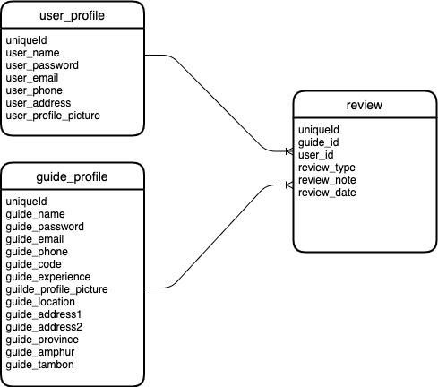

#  Local-Guide-API
     คือ API ที่ใช้สำหรับบันทึกข้อมูลผู้ใช้งานระบบ Local Guide โดยรับข้อมูลาจาก Local-Guide-GUI

## 📦 Built With
- [X] nodeJS

## 📋 Feature
### API USER
- API USER [GET] /api/user/
- API USER [GET] /api/user/:id
- API USER [POST] /api/user/
- API USER [PUT] /api/user/:id
- API USER [PATCH] /api/user/:id
- API USER [DELETE] /api/user/:id
- API USER [GET] /api/user/review/:id

### API GUIDE
- API GUIDE [GET] /api/guide/
- API GUIDE [GET] /api/guide/:id
- API GUIDE [POST] /api/guide/
- API GUIDE [PUT] /api/guide/:id
- API GUIDE [PATCH] /api/guide/:id
- API GUIDE [DELETE] /api/guide/:id
- API GUIDE [GET] /api/guide/review/:id

### API CHECK
- API [GET] /health

## ⚙ How to use
-

## ER Diagram

## 🏷 Version

### version 0.1.2
- update ER Diagram

### version 0.1.1
- init project